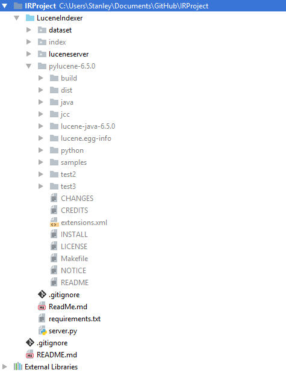

# The PyLucene Project

Welcome to the project to try to get Apache Lucene working with
a Python Wrapper around it. This document will be updated
frequently with new features and improvements in response to your
feedback.

Before we go on you should know that this is a notoriously difficult
product to build and you should therefore not be alarmed about
the milliards of requirements that are going to be listed.

This is confirmed working under the given requirements. I have tried
to offer flexibility where possible but you may have to debug a bit
if you do decide to deviate from this setup.

# Installing the Prerequisites

You need to have the following installed on your computer. Recommended
download links are given where appropriate. I would recommend to do
everything via Anaconda 3.6 with 64bit everything (apart from Ant).
This has been confirmed working by me and hopefully should work for
everybody else as well

- Python 3.6 via Anaconda 64 bit. This should also work with non anaconda installations.
- 64 bit version of JDK 1.8.
- [Microsoft Visual C++ Build Tools](https://www.microsoft.com/en-us/download/details.aspx?id=48159)
for python 3.6.
- The latest (but still old) build of [WinAnt](https://code.google.com/archive/p/winant/downloads).
Don't worry that it's not 64 bit. It's not trouble at all in this case.
- 64 bit [Cywgin](https://www.cygwin.com/) - a windows environment to run make.
During installation please search for the package "make" and choose to
install it. You have to make sure to explicitly do this.

# Setting the Environment Variables

Any install guide for Windows wouldn't be complete without our long
trusted friends - the Environment Variables!

```
JAVA_HOME = C:\Program Files\Java\jdk1.8.0_144
JCC_JDK = C:\Program Files\Java\jdk1.8.0_144
PATH += ;%JAVA_HOME%\bin
PATH += ;%JAVA_HOME%\jre\bin\server
PATH += ;C:\cygwin\bin
ANT_HOME = C:\Program Files (x86)\WinAnt
CLASSPATH = .;C:\Program Files\Java\jdk1.8.0_144\lib
CLASSPATH += ;C:\Program Files\Java\jdk1.8.0_144\jre\lib
CLASSPATH += ;C:\Program Files\Java\jdk1.8.0_144\lib\tools.jar
```

# Installing Apache Lucene
We've come a long way already. That was tough, but we have to keep going.

First download [Apache Lucene](http://www.apache.org/dyn/closer.lua/lucene/pylucene/).
Extract it into the directory where this readme is. I am purposely
ignoring this folder and not letting you upload it to GitHub
due to its size and that it should always be compiled from source
on everyone's machines separately.

Your directory structure should now roughly look as follows (probably with
the exception of the index and dataset folders:



First edit the variables in the makefile inside pylucene-x.x.x to
correspond to what you need for your system e.g.

```
PREFIX_PYTHON=C:\Users\Stanley\AppData\Local\Programs\Python\Python36-32
ANT=C:/Progra~2/WinAnt/bin/ant
JAVA_HOME=C:/Progra~1/Java/jdk1.8.0_144
PYTHON=$(PREFIX_PYTHON)/python.exe
JCC=$(PYTHON) -m jcc
NUM_FILES=8
```

The commands to install if everything goes well from the directory of this
readme are:

```
cd .\pylucene-6.5.0
pushd jcc
python .\setup.py build
python .\setup.py install
popd
make
make install
```

The make step should take a very long time.
After you've run all the steps you should be able to run the python script
included in this repository. I also recommend the PyCharm IDE as an awesome
environment to work with this.

Set the _lucene directory in the build folder as a sources route
to remove those red lines everywhere. However auto-completion of
code still doesn't work even with this. It will probably have
to stay this way unless I get a smart idea about how to solve it.

# Installing the LuceneIndexer Package
Run: ```pip install -r requirements.txt``` to install all pip
dependencies.

# Download the Necessary Data Set Files

Download the NIPS papers in .sqlite format from
[kaggle](https://www.kaggle.com/benhamner/nips-papers).

Then extract the .sqlite file to ```IRPoject\LuceneIndexer\dataset```

# Launch The Server

To launch the server simple cd to the LuceneIndexer directory and run
```python .\server.py```

And then query away. This is just an example of the functionality that is going to
come further down the line.


# What To Do If You Get Stuck
I have tried this installation guide on another clean-ish Windows machine.

However, chances are, this documentation isn't complete. It probably works for me
but doesn't for you. What options are left for you? Some serious googling.
And then update this file. Please please please update this file.
You'll be helping out everyone else who has to work on this. And
of course our professor since he has to be able to build this for
grading the project.

If your build fails and the errors have something to do with visual studio,
try going to control panel -> add/remove programs and "repair" the install
of the build tools. This fixed my problems all the time that I was working.